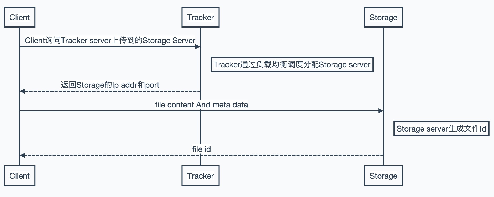
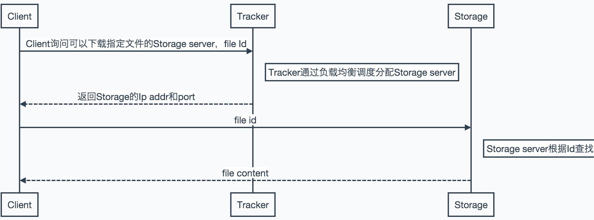

# FastDFS

标签（空格分隔）： FastDFS 分布式文件系统

---

[TOC]

## 分布式文件系统
### 什么是分布式文件系统

    分布式文件系统（Distributed File System，DFS）
    
    百度文库：分布式文件系统可以解决数据的存储和管理难题：将固定于某个地点的某个文件系统，扩展到任意多个地点/多个文件系统，众多的节点组成一个文件系统网络。每个节点可以分布在不同的地点，通过网络进行节点间的通信和数据传输。
    
    我的理解：好比一个局域网中有多台服务器，共享文件夹分布在不同的服务器上，通过分布式文件系统把不同服务器上的共享文件组织在一起，构成一个目录tree。从用户的角度来看，这些共享文件存储在一个位置（不需要关心物理位置），访问一个共享的DFS树，就可以访问相应的文件

## FastDFS简介

    FastDFS是一个开源的分布式文件系统，用纯C语言实现，支持Linux，AIX等UNIX系统。FastDFS只能通过专有API对文件进行存取访问，不支持POSIX接口方式
    
## FastDFS设计理念
    FastDFS可以说是为互联网应用量身定做的分布式文件系统，充分考虑了冗余备份、负载均衡、线性扩容等机制，并注重高可用、高性能等指标。FastDFS的独到之处主要体现在轻量级、分组方式和对等结构三个方面

### 轻量级
	FastDFS只有两个角色：Tracker server和Storage server
    
#### Tracker server

 * Tracker server是中心结点，其主要作用是负载均衡和调度。

 * Tracker server在内存中**记录分组**和**Storage server的状态**等信息，占用的内存量很少。

 * Client和Storage server访问Tracker server时，Tracker server扫描内存中的**分组**和**Storage server信息**，然后给应答。

#### Storage server

 * Storage server直接利用**OS的文件系统**存储文件。FastDFS **不会**对文件进行**分块存储**，客户端上传的文件和Storage server上的文件一一对应

 * 客户端上传文件时，文件ID(包含了组名、文件相对路径和文件名)不是客户端指定的，而是有Storage server生成后返回给客户端的。Storage server可以根据文件ID直接定位文件。

#### 总结
 * FastDFS的两个角色不需要存储文件索引信息，是FastDFS比较轻量级的例证

 * 代码量少，总代码行数不到5.2W行

### 分组存储方式

    FastDFS采用分组存储方式
#### 分组存储方式的结构组成
 * 集群：由一个或多个组构成，集群存储总容量为集群中所有组的存储容量总和。

 * 组：由一台或多台存储服务器构成，同组内的多台Storage server之间是互备关系，同组存储服务器上的文件是完全一致的。文件的上传、下载和删除等操作可以在组内任意一台Storage server上进行

#### 分组存储方式的好处
 * 上传文件时，可以由客户端直接指定上传到的组(如何指定？)

 * 一个组的存储服务器访问压力较大，可以在改组增加服务器来进行扩充（纵向扩充）

 * 系统容量不足时，可以增加组来进行扩充（横向扩充）

### 对等结构
    FastDFS集群中的Tracker server也可以有多台，Tracker server和Storage server均不存在单点问题。

 * Tracker server之间是对等关系，组内的Storage server之间也是对等关系。与Master-Slave结构不同

## 上传文件命令

    启动tracker服务：
    /usr/local/bin/fdfs_trackerd /etc/fdfs/tracker.conf
    
    启动Storage服务：
    /usr/local/bin/fdfs_storaged /etc/fdfs/storage.conf
    
    监控：
    /usr/local/bin/fdfs_monitor /etc/fdfs/storage.conf
    
### 测试上传文件

    Usage: fdfs_test <config_file> upload <local_filename> [FILE | BUFF | CALLBACK]

    fdfs_test /etc/fdfs/client.conf  upload 1.jpg 
    
## FastDFS系统设计

### 系统结构图
![FastDFS系统架构][1]

### 系统结构解析
#### Tracker server如何获取Storage server的状态信息?
    
* Storage server主动向Tracker server报告其状态信息，包括磁盘剩余空间、文件同步状况、文件上传下载次数等统计信息（连接集群中所有的Tracker server）
* Storage server启动一个单独的线程来完成对一台Tracker server的连接和定时报告
    
#### Storage server不同组及同组之间如何进行数据同步？

* 不同组的Storage server之间不会相互通信，同组内的Storage server之间会相互连接进行文件同步
* Storage server采用binlog文件记录文件上传、删除等更新操作。binlog中只记录文件名，不记录文件内容
* 文件同步只在同组内Storage server之间进行，采用Push方式，即源头服务器同步给目标服务器。只有源头数据才需要同步，备份数据不需要同步（新增服务器除外）
* Storage server中有专门的线程根据binlog进行文件同步，对组内除自己外的每台服务器都会启动一个线程来进行文件同步

### 文件上传和下载交互过程

#### 文件上传

#### 文件下载

## 文件同步问题及FastDFS的解决方案

### 文件同步延迟问题的提出
    文件上传成功后，Storage server根据binlog中的上传记录将这个文件同步到同组的其他Storage server（异步方式，因此会带来文件同步的延迟），新上传文件后，在尚未同步的Storage server上访问该文件，会出现找不到文件的现象
    
    文件的访问分为两种情况：文件更新和文件下载
    
#### 文件下载解决方案
    文件名包含：Storage server的IP地址和文件创建时间(时间戳)等字段
    
* 文件同步采用Push方式，每台Storage server都会定时向Tracker server报告它向同组其他Storage server同步到的文件时间戳
* Tracker server收到 一台Storage server的同步的时间戳后，会找出同组内各个Storage server同步时间戳最小的存储起来(存储在内存中)
    
#### 文件更新解决方案
* 文件更新包括设置文件附加属性（文件大小、图片宽度、图片高度等）和删除文件。
* FastDFS在文件更新操作都会优先选择源Storage server（文件上传到的那台服务器）

### FastDFS文件访问时返回Storage server条件
    返回满足一下四个条件之一的Storage server
    
* 文件上传的源Storage server
* 文件创建时间戳 < Storage server同步的时间戳（该Storage server已经同步了该文件）
* 文件创建时间戳 = Storage server同步的时间戳时，且（当前时间 - 文件创建时间戳） > 单个文件同步完成的时间（例如：一个文件完成同步需要5分钟）
* （当前时间 - 文件创建时间戳）> 文件同步延迟阈值。例如：阈值设置为1天，文件同步一天内肯定可以完成

  [1]: http://file.100xuexi.com/XXSub/MatUpPT/Image/201206221404264607046.jpg
